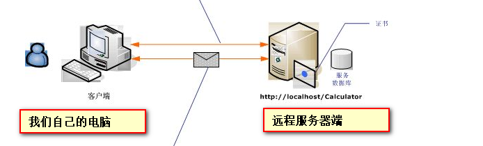
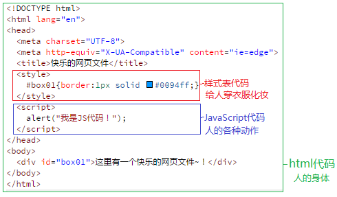
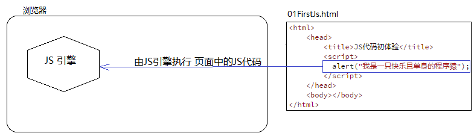
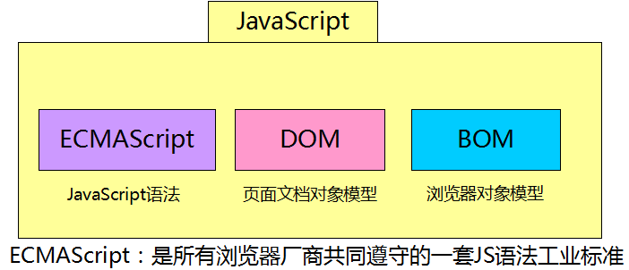
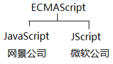
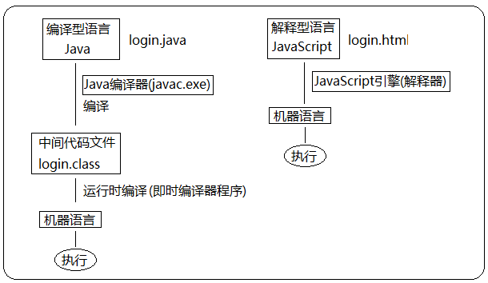

> 第02阶段.前端基本功.前端基础.入门语法

# 认知 JavaScript

## 学习目标
* 理解
  * 能说出 JavaScript 是什么
  * 能说出 HTML、CSS、JS 的关系
  * 能说出 JS 基本运行原理
  * 能说出JS有那三部分组成
  * 简单了解js 的发展历史

## 一.核心内容

### 1. JavaScript 是什么

**概念：**

- JavaScript 是世界上最流行的语言。
- JavaScript是一种运行在***客户端*** 的**脚本语言** script
- 脚本语言：  不需要编译，-运行过程中由js解释器(js引擎）逐行来进行解释 并执行
- 现在也可以基于Node.js技术进行服务器端编程。

#### 1.1 为什么要学 JavaScript

> 演示：

- 页面各类动态广告
- 表单动态校验（密码强度检测）  （也是我们js 产生最初的目的）
- 各类动画效果（百度地图）
- 在线游戏（偷菜、三国志）

#### 1.2 HTML/CSS/JS 关系####

+ HTML/CSS 是 **标记语言--描述类语言**

  HTML 决定网页结构和内容( 决定看到什么 )，*相当于人的身体*

+ CSS 决定网页呈现给用户的模样( 决定好不好看 )，*相当于给人穿衣服、化妆*

+ JavaScript 是 **脚本语言--编程类语言**

  实现业务逻辑和页面控制( 决定功能 )，*相当于人的各种动作*

### 2.浏览器执行JS简介

JavaScript是一种运行在***客户端*** 的**脚本语言** 

浏览器内核分成两部分渲染引擎和js引擎，由于js引擎越来越独立，内核就倾向于只指渲染引擎

渲染引擎：用来解析HTML与CSS，俗称内核。比如 chrome 浏览器的 blink

JS引擎   :   我们成为js 解释器 用来 读取网页中的JavaScript代码，对其处理后运行   比较经典 就是 chrome  浏览器的 V8

**总结：**  

1. 浏览器本身并不会执行JS代码，而是通过内置 **JavaScript引擎(解释器)** 来执行JS代码,并且转换为机器语言

2. JS引擎执行代码是逐行解释每一句源码，所以 JavaScript语言 归为 脚本语言，逐行解释执行。

### 3. JavaScript 的组成（重要）

- **ECMAScript  （ECMA 欧洲计算机制造联合会） 是 javascript 的核心  也是我们后面学习的重点**

  ECMAScript是一套JS语言设计标准，描述 JavaScript 语言基本语法和数据类型，以及其它实现标准。

  

  简单理解  ECMAScript是JavaScript的语言规范，JavaScript是ECMAScript的实现和扩展。

- BOM - 浏览器对象模型

  一套提供给程序员 **操作浏览器功能** 的API

  alert()

  通过BOM可以操作浏览器窗口，比如：弹出框、控制浏览器跳转、获取分辨率等

- DOM - 文档对象模型

  一套提供给程序员 **操作页面元素** 的API

  通过DOM提供的API可以对页面上的各种元素进行操作（大小、位置、颜色等）

## 3.扩展内容 @

### 3.1  JS 历史(了解)

布兰登·艾奇（Brendan Eich，1961年～） 

 

Netscape在最初将其脚本语言命名为LiveScript，后来Netscape在与Sun合作之后将其改名为JavaScript。

​	Java  服务器端的编程语言

​	JavaScript  运行在客户端(浏览器)的编程语言

### 3.2 JavaScript 应用场景(了解)

JavaScript 发展到现在几乎无所不能。

1. 网页特效
2. 服务端开发(Node.js)
3. 命令行工具(Node.js)
4. 桌面程序(Electron)
5. App(Cordova) 
6. 控制硬件-物联网(Ruff)
7. 游戏开发(cocos2d-js)

### 3.3 解释型语言 和 编译型语言

*计算机不能直接理解任何除机器语言以外的语言*，所以必须要把程序员所写的程序语言翻译成机器语言，计算机才能执行程序。*程序语言翻译成机器语言的工具，被称为编译器*

编译器翻译的方式有两种：一个是*编译*，另外一个是*解释*。两种方式之间的区别在于*翻译时间点的不同*。

编译器是在代码执行之前进行编译，生成中间代码文件。

解释器是在运行时进行及时解释，并立即执行。(当编译器*以解释方式运行的时候*，也称之为*解释器*)

## 4.深度阅读 @

[《前端必读：浏览器内部工作原理》 ](http://www.cnblogs.com/jameszou/p/8470097.html)

[《漫谈JS引擎的运行机制 你应该知道什么》 ](http://www.jb51.net/article/86663.htm)

