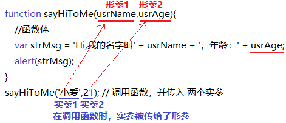
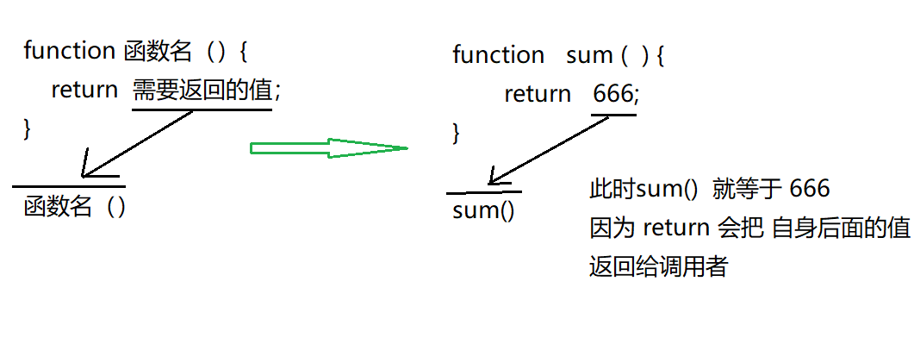
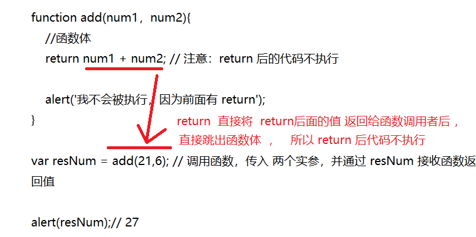
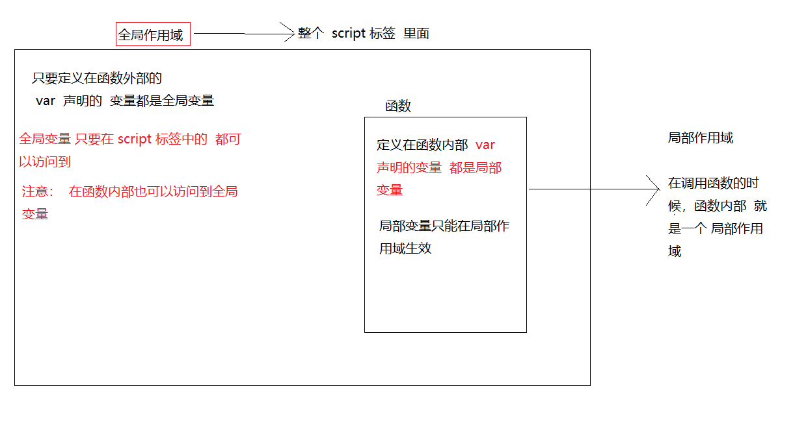
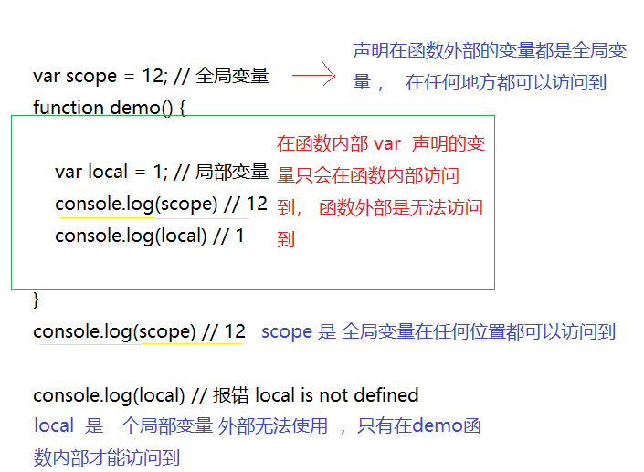
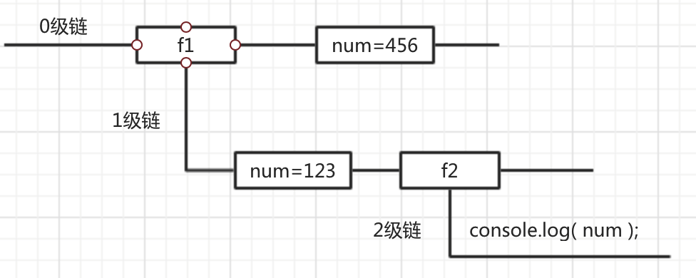

> 第02阶段.前端基本功.前端基础.进阶语法

# 函数（重点）

## 学习目标
* 理解
  * 函数的作用
  * 函数的定义以及操作
  * 函数的参数
* 应用
  * 能使用函数
  * 能根据需求封装函数
  * 能给函数传递不同的参数
  * 能使用函数的返回值

## 一.核心内容

## 1.函数（重点）

### 1.1 为什么需要函数？

虽然for也能实现一些简单的 重复操作，但是 比较具有局限性。  

我们js 里面，也有非常多的相同代码，可能需要大量重复使用。 此时我们可以利用函数。

### 1.2 什么是函数以及使用

+ 函数 就是 封装了 一段 可被**重复调用执行**的 代码块。 可以实现大量代码的重复使用。 非常赞

```` js
函数声明 
function 函数名() {
    //函数体代码
}
//函数调用
函数名();// 通过调用函数名来 执行函数体代码
````

+ 函数语法 分 函数声明 和 函数调用，函数声明本身并不会执行代码，只有调用函数 时 才会执行函数体

```` js
//  函数声明
function sayHi(){ 
    //函数体
    alert('Hi~~');
}
// 函数调用
sayHi(); // 调用函数时，会逐行执行 函数里的代码
````

> **课堂案例**
> 要求：计算1-100之间的值

```` js
/* 
   计算1-100之间值的函数
*/
function getSum(){
  var sumNum = 0;// 准备一个变量，保存数字和
  for (var i = 1; i <= 100; i++) {
    sumNum += i;// 把每个数值 都累加 到变量中
  }
  alert(sumNum);
}
//调用函数
get100Sum();
````

**pink老师提问**

* 函数做什么的（目的）？
* 封装是啥 意思？ 
* 声明函数 用什么关键词 
* 如何调用函数

### 1.3 带参数的函数

汽车就是已经封装好的函数，我们直接开就好了，但是，我们可以换不同的档位，实现加速效果。

我们的函数是可以接受点餐服务的

#### 1)  函数参数

  **参数  :  在函数内部某些值不能固定，只有在调用的时候才能确定这个值**

| **参数** | 定义                                                         |
| -------- | ------------------------------------------------------------ |
| **形参** | **形式上的参数  函数定义的时候 传递的参数  当前并不知道是什么 ** |
| **实参** | **实际的参数  函数调用的时候传递的参数 这个参数我们知道 给形参赋值** |

+ **语法：**

```` js
// 带参数的函数声明
function 函数名(形参1,  , 形参3...) { // 可以定义任意多的参数，用 逗号 分隔
  // 函数体
}

// 带参数的函数调用
函数名(实参1, 实参2, 实参3); 
````

**如：**

```` js
function sayHiToMe(usrName,usrAge){
    //函数体
    var strMsg = 'Hi,我的名字叫' + usrName + '，年龄：' + usrAge;
    alert(strMsg);
}
sayHiToMe('小爱',21); // 调用函数，并传入 两个实参 '小爱' 和 21，分别 传给了形参 usrName 和 usrAge
````

**图解：**

  

> 自己课堂案例：
>
> 用函数封装 根据传入的 任意2个数值的和
~~~js
function getSum(num1, num2) {
    console.log(num1 + num2);
}
getSum(1, 3); // 4
getSum(6, 5); // 4
~~~

**总结**

* 函数可以带参数也可以不带参数
* 声明函数的时候，函数名括号里面的是 形参 类似一个变量 接受数据的
* 调用函数的时候，函数名括号里面的是 实参。
* 多个参数中间用 逗号分隔。
* 形参的个数可以和实参个数不匹配，但是结果不可预计，我们尽量要匹配。

### 1.4 带返回值的函数


+ 通俗 来讲返回值就是      我 让你去超市帮我买包烟 ， 你帮我买了之后 并把 烟 返回给我   
+ 刚才的 console  再函数内 输出是没有价值的。
+ 返回值概念：函数执行完后，可以把执行的结果 通过 return 语法 返回给 调用者
+ 返回值本质  就是 调用函数   并将需要 值返回给  调用者  
  - 函数外部想使用函数内部的值的时候 可以使用return

```js
语法：
function 函数名（）{
    return  需要返回的值；
}
函数调用
函数名（）    //   此时 调用 函数就可以得到   函数体内return  后面的值   
```



#### 注意：retrun 后的代码不被执行

```js
function add(num1，num2){
    //函数体
    return num1 + num2; // 注意：return 后的代码不执行
    alert('我不会被执行，因为前面有 return');
}
var resNum = add(21,6); // 调用函数，传入 两个实参，并通过 resNum 接收函数返回值
alert(resNum);// 27
```


> **小细节 : break ,continue ,return 的区别**

| break        | 结束当前的循环体 （for   while ）                  |
| ------------ | -------------------------------------------------- |
| **continue** | **跳出本次循环，继续执行下次循环（for   while ）** |
| **return**   | **返回return 中的值 同时结束当前的函数体内的代码** |


> **课堂案例**
> **要求：求一个数组 [5,2,99,101,67,77] 中的最大数值**

```` js
//定义一个 获取数组中 最大数 的函数
function getMaxFromArr(numArray){
    var maxNum = 0;
    for(var i =0;i < numArray.length;i++){
        if(numArray[i] > maxNum){
            maxNum = numArray[i];
        }
    }
    return maxNum;
}
//定义一个数值数组
var arrNum = [5,2,99,101,67,77];
//调用函数获取最大值
var maxN = getMaxFromArr(arrNum);
//打印最大值
alert('最大值为：'+ maxN);
````

### 1.5  函数大练习

> **课堂案例**
> **要求：翻转数组，返回一个新数组**

```js
function reverseFun(arr) {
   var newArr = [];
     for (var i = 0; i < arr.length; i++) {
         newArr[i] = arr[arr.length - i - 1];
       }
      return newArr;
}
var arr = [1, 4, 2, 8];
var arr1 = ['pink', 'hotpink', 'deeppink'];
console.log(reverseFun(arr));
console.log(reverseFun(arr1));
```

> **课堂案例**
> **要求：对数组排序，从小到大** -- 冒泡排序

```js
function sort(array) {
            for (var i = 0; i < array.length - 1; i++) {
                for (var j = 0; j < array.length - i - 1; j++) {
                    if (arr[j] > arr[j + 1]) {
                        var temp = arr[j];
                        arr[j] = arr[j + 1];
                        arr[j + 1] = temp;
                    }
                }
            }
            return array;
        }
var arr = [2, 8, 1, 4, 9];
var arr1 = [2, 4, 8];
console.log(sort(arr));
console.log(sort(arr1));
```

> **课堂案例**
> **要求：输入一个年份，判断是否是闰年[闰年：能被4整数并且不能被100整数，或者能被400整数]

```js
function isRun(year) {
            var flag = false;
            if (year % 4 === 0 && year % 100 !== 0 || year % 400 === 0) {
                flag = true;
            }
            return flag;
        }
console.log(isRun(2010));
console.log(isRun(2012));
```

> **课堂案例**
> **输入某年某月某日，判断这一天是这一年的第几天？**

思路：

1. 先计算 输入的当前 月份的天数   
2. 计算加上 前面几个月的总天数
3. 月份不同 1.3 .5 .7 .8 .10 .12 月是 31 天     4, 6, 9, 11 是 30 天       2 月份 闰年是 29 天 否则 28
4. 这个函数 需要 三个参数 分别是 年 月  日

```js
  function isRun(year) {
            var flag = false;
            if (year % 4 === 0 && year % 100 !== 0 || year % 400 === 0) {
                flag = true;
            }
            return flag;
        }
        console.log(isRun(1998));

        function getDays(year, month, day) {
            // 先计算当前月的 天数
            var days = day;
            // 下面开始 累加 前面几个月的 总天数 
            for (var i = 1; i < month; i++) {
                // 月份不同  天数不同 我们用 switch
                switch (i) {
                    case 1:
                    case 3:
                    case 5:
                    case 7:
                    case 8:
                    case 10:
                    case 12:
                        days += 31;
                        break;
                    case 4:
                    case 6:
                    case 9:
                    case 11:
                        days += 30;
                        break;
                    case 2:
                        if (isRun(year)) {
                            days += 29;
                        } else {
                            days += 28;
                        }
                        break;
                }
            }
            return days;
        }

        console.log(getDays(1998, 5, 2));
```

> 课堂案例
>
> 1，1，2，3，5，8，13，21   求第9个数字是多少(可选)  斐波那契数列   

~~~js
 // 根据数列的规律1，1，2，3，5，8，13，21   求第9个数字是多少(可选)
        var num1 = 1;
        var num2 = 1;
        var num3 = 0;
        for (var i = 3; i <= 7; i++) {
            num3 = num1 + num2;
            num1 = num2;
            num2 = num3;
        }
        console.log(num3);
~~~

封装函数

~~~js
 function getFib(num) {
            var n1 = 1;
            var n2 = 1;
            var n3;
            for (var i = 3; i <= num; i++) {
                n3 = n1 + n2;
                n1 = n2;
                n2 = n3;
            }
            return n3;
        }
        console.log(getFib(7));
~~~

 

**课后作业**

```js
    1. 写一个函数，计算任意两个数字的任意算术运算（简单的计算器小功能），并能返回运算后的结果。

    2. 写一个函数，求任意两个不同数字的最大值，并能返回运算后的结果。

    3. 写一个函数，求任意三个不同数字的最大值，并能返回运算后的结果。

    4. 写一个函数，实现反转任意数组。

    5. 写一个函数，实现对数字数组的排序。

    6. 写一个函数，判断一个数是否是素数，并返回值(又叫质数，只能被1和自身整数的数)

    7. 写一个函数接收某年某月某日，判断这一天是这一年的第几天，并返回结果？
```

### 1.6 函数参数和返回值注意事项

**1. 函数返回值 **

~~~js
function fn() {
}
console.log(fn());   // 如果没有return  返回的值是 undefined
~~~

**2. 函数形参和实参 数量可以不一定匹配**

~~~js
function getSum(x, y, z) {
    return x + y + z;
}
console.log(getSum(1, 2, 3)); // 6 
console.log(getSum(1, 2, 3, 4)); // 6
console.log(getSum(1, 2)); // NaN
~~~


### 1.7 arguments的使用

> JavaScript中，arguments对象是比较特别的一个对象，实际上是当前函数的一个内置属性。也就是说所有函数都内置了一个arguments对象，**arguments对象中存储了传递的所有的实参**。arguments是一个**伪数组**，因此及可以进行遍历

**当我们不确定有多少个参数传递的时候，可以用arguments 来获取**


> **课堂案例**
> **要求：求任意个数的和**

```js
 function sumFun() {
            var sum = 0;
            for (var i = 0; i < arguments.length; i++) {
                sum += arguments[i];
            }
            return sum;
        }
console.log(sumFun(1, 3, 5));
console.log(sumFun(2, 4, 6));
```

> **课堂案例**
> **要求：求任意个数的最大值**

```js
function maxValue() {
            var max = arguments[0];
            for (var i = 0; i < arguments.length; i++) {
                if (max < arguments[i]) {
                    max = arguments[i];
                }
            }

            return max;
        }
 console.log(maxValue(2, 4, 5, 9));
 console.log(maxValue(12, 4, 9));
```


###1.8  定义函数有两种方式

* **1. 函数声明方式**

咱们前面学的 

```js
// 命名函数   有函数名 为  fn 
function fn() { ....}
// 调用  那个地方调用都可以
fn()  
```

- **2. 函数表达式方式**

语法格式：

~~~js
// 这是 函数表达式 写法   匿名函数后面跟分号结束
var  fn =  function () { ....  }；
// 调用的方式  但是这个方式，函数调用必须写到函数体下面
fn();
~~~

1. 函数没有名字，我们称为匿名函数


2. 这个fn 里面存储的是一个函数  
3. 这个执行的原理 跟我们 学的 变量使用一致的。

~~~js
var num = 10; 
console.log(num);
num = 20;
console.log(num);
~~~

有些函数没必要一定给名字， 比如我们 点击某个按钮，就执行一个代码 

~~~js
// 点击按钮  就执行一段代码， 没必要给这个函数再命名了。直接跟一个匿名函数就好了
btn.onclick = function() { ...}; 
~~~

这个我们后面会经常使用，我们后面会再强调。

~~~js
var fn = function(x, y) {
    return x + y;
}
console.log(fn(1, 2));
~~~

### 1.9  自执行函数(了解)

- **匿名函数除了作为参数传递外，也可以作为启动函数，定义后立即自执行**

```js
(function () {
  alert('我是匿名函数，被自执行啦~~！');
})();
```

匿名函数自动执行写法的，最大的好处，就是  防止命名冲突， 这种函数永远不会冲突。

还是，后面我们js 高级里面会详细讲解。

### 1.10 函数也是一种数据类型

~~~js
function fn() {
   console.log('11');
 }
 console.log(typeof fn) // function
~~~

### 1.11 函数可以作为参数(了解)

函数可以接受任何类型的数据作为参数， 数值  字符 甚至是函数类型

  首先我们先看下面

~~~js
var fn = function() {
     console.log('我是一个函数');
};
 console.log(fn);

function getFn() {
       console.log('我也是一个函数')
}
 console.log(getFn);
~~~

函数名（变量名）   里面存放的是   函数

~~~js
function getFn() {
    console.log('我也是一个函数')
 }
 // 声明函数
 function fn(fun) {
     // 调用传递过来的 函数
     fun();
}
// 调用函数
fn(getFn);
~~~

### 1.12 函数可以作为返回值(了解)

~~~js
function fn() {
    return function() {
        console.log('函数可以作为返回值');
    }
}

var ff = fn();
// 相当于
// var ff = function() {
//     console.log('函数可以作为返回值');
// };
ff();
~~~

## 2. 作用域

作用域：变量可以起作用的范围 （区域）

#### 2.1全局变量和局部变量

- 全局作用域

  供所有代码执行的环境(整个script标签内部)  或者一个独立的js文件中  

- 局部作用域（私有作用域）

  在调用函数的时候，会形成一个执行函数内代码的新环境。

- 全局变量

  - 在全局作用域下声明的变量叫做全局变量（在函数外部定义的变量）
  - 全局变量在代码的任何位置都可以使用
  - 特殊情况， 再函数内 不var 声明 的 变量  也是全局变量 （不建议使用）

- 局部变量

  - 在局部作用域下声明的变量叫做局部变量（在函数内部定义的变量）
  - 局部变量只能在该函数内部使用



- 案例：

```javascript
var scope = 12; // 全局变量
function demo() {
    var local = 1; // 局部变量
    console.log(scope) // 12
    console.log(local) // 1
}
console.log(scope) // 12
console.log(local) // 报错 local is not defined
```



#### 2.2 注意

- 函数的形参实际上就是局部变量
- 局部变量当其所在的代码块被执行时，会被初始化，当代码块运行结束后，就被销毁了，节省内存空间。
- 全局变量因为任何一个地方都可以使用，只有再浏览器关闭才会销毁，比较占内存。

## 3. 作用域链

大家还记得 绝对定位吗？  它是以  带有定位的父级 对齐的。

- 只要是代码，就至少有一个作用域
- 写在函数外部的是全局作用域
- 写在函数内部的局部作用域
- 如果函数中还有函数，那么在这个作用域中就又可以诞生一个作用域。
- 根据在内部函数可以访问外部函数变量的这种机制，用链式查找决定哪些数据能被内部函数访问。 就称作作用域链。

```js
// 案例1：
function f1() {
    function f2() {
    }
}

var num = 456;

function f3() {
    function f4() {    
    }
}
```


```js
// 案例2
function f1() {
    var num = 123;
    function f2() {
        console.log( num );
    }
    f2();
}
var num = 456;
f1();
```



#### 思考题

~~~js
var a = 1;
function fn1(){
  var a = 2;
  var b = '2b';
  function fn2(){
    var a = 3;
    function fn3(){
      var a = 4;
      console.log(a);   //a的值 ?
      console.log(b);    //b的值 ?
    }   
  }
}
~~~

~~~js
var a = 1;
function fn1() {
    var a = 2;
    var b = '22';
    fn2();
    function fn2() {
        var a = 3;
        fn3();
        function fn3() {
            var a = 4;
            console.log(a); //a的值 ?
            console.log(b); //b的值 ?
        }
    }
}
fn1();
~~~


## 4. 预解析

先看一个问题：

~~~js
console.log(num);  // 结果是多少？
~~~

第二个问题

~~~js
console.log(num);  // 结果是多少？
var num = 10;  
~~~

第三个问题

~~~js
fn();
function fn() {
    console.log('打印');
}
~~~

第四个问题

~~~js
fn();
var  fn = function() {
    console.log('想不到吧');
}
~~~

JavaScript代码是由浏览器中的JavaScript解析器来执行的。JavaScript解析器在运行JavaScript代码的时候，分为两步：预解析和代码执行

学习预解析能够让我们知道 为什么在变量声明之前访问变量 值是undefined 为什么在函数声明之前就可以调用函数

- 预解析过程
  - JavaScript解析器会在全局环境下查找 var、function关键字，**变量只声明不赋值，函数声明不调用。**
  - 预解析只发生在**当前作用域下**
- 预解析也叫做变量、函数提升

  - 变量提升

    定义变量的时候，变量的声明会被提升到当前作用域的最上面，变量的赋值不会提升。

  - 函数提升

    JavaScript解析器首先会把当前作用域的函数声明提前到整个作用域的最前面

  - 变量名和函数名相同，优先执行 函数


- 执行过程
  - 变量赋值、函数调用、表达式运算等等。

所以解答刚才的 问题：

~~~js
console.log(num);  // 结果是多少？
var num = 10;  
~~~

等价于：

~~~js
// 变量提升 只提升声明  不赋值
var num;
console.log(num);
num = 10;
~~~

课堂练习：

~~~js
// 练习 1
alert(a)
alert(fn)

var a = 1;
function fn(){ 
    return false;
};


// 练习2
alert(a);
var a = 1;
alert(a)
function a(){
    return false;
}
~~~

#### 课堂案例

```javascript
// 案例1
var num = 10;
fun();
function fun() {
  console.log(num);
  var num = 20;
}
```

```javascript
// 案例2
var num = 10;
function fn(){
    console.log(num);
    var num = 20;
    console.log(num);
} 
fn();
```


```javascript
// 案例3
var a = 18;
f1();
function f1() {
  var b = 9;
  console.log(a);
  console.log(b);
  var a = '123';
}

// 案例4
var a = 25;
function abc (){
  alert(a);
  var a = 10;
}
abc();
console.log(a);
function a() {
  console.log('aaaaa');
}
var a = 1;
console.log(a);

// 案例5
f1();
console.log(c);
console.log(b);
console.log(a);
function f1() {
  var a = b = c = 9;
  console.log(a);
  console.log(b);
  console.log(c);
}
```

- 扩展：JS中没有块级作用域【了解】

  - 什么是块级作用域

    > ​	在其他编程语言中，如java、c#等，在if语句、循环语句中创建的变量，仅仅只能在本if语句、本循环语句中使用。如下Java代码
    >
    > ```javascript
    > if(true){
    >   int num = 123;
    >   system.out.print(num);  //123;
    > }
    > system.out.print(num); //报错
    > ```

    ​

  - Js中没有块级作用域（在ES5之前）

    > ```javascript
    > if(true){
    >   var num = 123;
    >   console.log(123); //123
    > }
    > console.log(123);  //123;
    > ```


### 课堂一练

1. 下列代码的运行结果？原因是什么？

   ```javascript
   console.log(a + 2);   //？
   var a = 2;
   console.log(a + 2);  //？
   ```

   ​

2. 下列代码的运行结果？原因是什么？

   ```javascript
   fn(); 　 //?　　
   var fn = function(){
   	alert(1);
   }
   ```

   ​

3. 下列代码的运行结果？原因是什么？

   ```javascript
   fn();  //?
   function fn(){
   	alert(2);
   }

   ```

   ​

4. 下列代码的运行结果？原因是什么？

   ```javascript
   var a = 1;
   var b = 2;

   function fn(a,b) {
     console.log(a + b);   
   }

   fn(); //?

   ```

   ​

5. 下列代码的运行结果？原因是什么？

   ```javascript
   var a = 123;
   function test() {
     console.log( a + 2);  //?
     var a = 2;
      console.log( a + 2);  //?
   }
   test();
   ```

   ​

6. 下列代码的运行结果？原因是什么？

   ```javascript
   function test(f) {
   		f(123);
   }

   test( function(v){
   	alert(v + 3);//?
   } );
   ```


## 二. 课后综合练习（作业）

>  **课堂案例**
>  **要求：简版计算器，提供 加减乘除 功能**

```` js
//1.获取用户的操作项（加减乘除、退出）
function getOpe(){
	var usrOpt = prompt('欢迎使用简易计算器：\r 1.加法运算；\r 2.减法运算；\r 3.乘法运算；\r 4.除法运算；\r 5.退出；\r 请输入您的选项：');
	usrOpt = parseInt(usrOpt);
	return usrOpt;
}
//2.获取一个用户输入的数值
function getANum(){
	var usrNum = prompt('请输入一个数值：');
	usrNum = parseInt(usrNum);
	return usrNum;
}
//3.执行算数运算，并返回结果
function doOperate(oprator,num1,num2){
	var res = 0;
	switch(oprator){
		case 1://加法运算
		res = num1 + num2;
		break;
	case 2://减法运算
		res = num1 - num2;
		break;
	case 3://乘法运算
		res = num1 * num2;
		break;
	case 4://除法运算
		res = num1 / num2;
		break;
	}
	return res;//返回计算结果
}
//4.启动功能
function startOpe(){
	while(true){
        //1.显示操作项目 获取用户选项
        var usrOpt = getOpe();
        if(usrOpt>=5){
            alert('计算器退出运行，感谢使用！');
            break;//退出循环
        }
        //2.获取 用户输入的两个 数值
        var usrNum1 = getANum();
        var usrNum2 = getANum();
        //3.根据用户选项进行 两个数的运算
        var res = doOperate(usrOpt,usrNum1,usrNum2);
        //4.显示执行结果
        alert(res);
	}
}
//5.启动计算器
startOpe();
````

